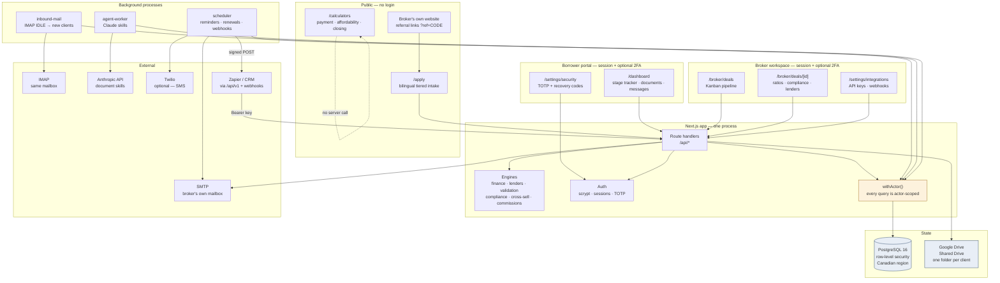
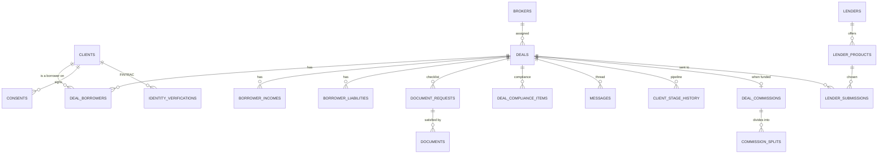
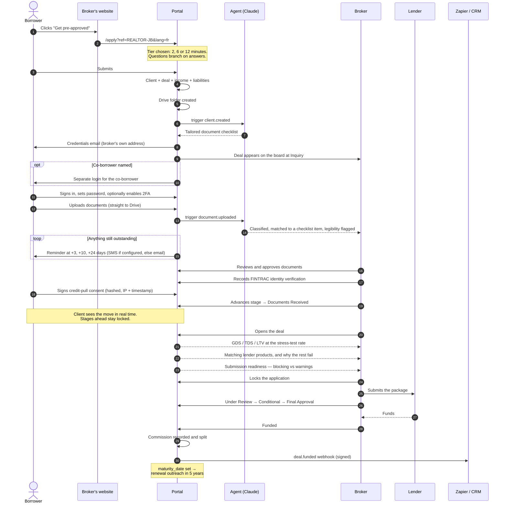

# Platform architecture

The four deliverables asked for: how the pieces fit together, why this stack, what the database
looks like, and the path a lead takes from a website click to funded.

---

## 1. System architecture

**The load-bearing detail is `withActor()`.** Every database call in the application goes through
it. It opens a transaction, sets `app.actor_type` and `app.client_id` as transaction-local
settings, and runs the query. Postgres row-level security policies read those settings. The app
connects as `uwa_app`, a role that owns nothing and has neither `SUPERUSER` nor `BYPASSRLS` — so
isolation holds even when the application layer is wrong. There is no raw-query escape hatch.

Documents never touch the application's disk. Uploads stream to Google Drive and downloads stream
back through an authenticated route, so there is no public link to leak and no file to lose when a
container is replaced.

---

## 2. Tech stack, and why

| Layer | Choice | Reasoning |
|---|---|---|
| Framework | **Next.js 16, App Router, React 19** | Server components mean the ratio panel, the pipeline and the document list render on the server with no API round trip and no client-side data store. One deployable for pages and API. |
| Language | **TypeScript, strict + `noUncheckedIndexedAccess`** | The schema drift between SQL and Drizzle has been caught at compile time three times in this repo. |
| Database | **PostgreSQL 16** | Row-level security is the whole security model. No other mainstream database enforces per-row isolation in the engine. |
| ORM | **Drizzle** | Thin. Generates SQL you can read, and the schema is TypeScript so a missing column fails the build. |
| Auth | **scrypt + opaque session cookies, node:crypto** | No dependency on the authentication path. TOTP is ~80 lines against RFC 6238 and is verified against the RFC's own vectors. |
| Files | **Google Drive API, service account on a Shared Drive** | Your requirement. A Shared Drive is required — a service account has no storage quota of its own, which is the trap that breaks most implementations. |
| Email | **nodemailer (SMTP) + imapflow (IMAP IDLE)** | Sends from the broker's own mailbox, so SPF and DKIM already pass and clients see a person. The same mailbox is watched for inbound enquiries. |
| AI | **Anthropic SDK, `claude-opus-5`** | Document classification, checklist generation, income flags. Entirely optional — leave the key unset and the portal works. |
| Styling | **Tailwind v4 with `@theme` tokens** | One token file drives the whole palette. |
| Realtime | **Server-Sent Events** | One-directional and reconnects itself. WebSockets would be more machinery for no gain. |
| Deployment | **Docker Compose, `output: standalone`** | Portable. Runs on a $12 VPS, ECS, Fly, or a Codespace. |

**Hosting for PIPEDA.** Any provider with a Canadian region works — the constraint is where the
Postgres volume and the Drive files live, not who runs the compute. `ca-central-1` on AWS,
`northamerica-northeast1` on GCP, Canada Central on Azure. Google Workspace data region policy
pins Drive content to Canada.

---

## 3. Core database schema

Thirty-nine tables. The ones that carry the model:

**Deals are first class, clients are identities.** One person, one login, many applications — a
purchase this year and a refinance in three. That is why `deal_borrowers` is a join table rather
than columns on `deals`: the number of borrowers is genuinely variable, and each one is a real
person with their own credentials.

**A co-borrower sees the deal but not their co-borrower's finances.** `borrower_incomes` and
`borrower_liabilities` are scoped per client, not per deal. Enforced by policy, tested directly.

Key tables:

| Table | Holds |
|---|---|
| `clients` | Identity, credentials, TOTP, Drive folder id |
| `brokers` | Team, roles (`owner`/`agent`/`assistant`/`compliance`), submission profiles, commission split |
| `deals` | One application. Reference `UWA-2026-0001`, stage, property, mortgage terms, application lock, attribution |
| `documents` / `document_requests` | Checklist and what satisfies it. Four states: requested, in review, needs attention, approved |
| `deal_compliance_items` | Per-deal FINTRAC checklist, expanded per borrower |
| `lender_products` | The brokerage's product table and its qualification rules |
| `consents` | Signed consent with the document's SHA-256, so what was agreed to is provable |
| `audit_log` | Append-only. Who did what, to whom, when |

---

## 4. User flow: website click to funded

**Where each requirement lands in that flow:**

- *Conditional branching* — step 3. A buyer is never asked their current lender.
- *Automatic profile creation* — steps 5–9. Same path whether the lead arrives by form, by email,
  or through the API.
- *Manually advanced stages* — steps 22 and 32. Nothing in the codebase auto-advances a client.
- *Independent co-borrower logins* — step 10.
- *Row-level security* — every step. The borrower's dashboard query has no `WHERE client_id`; the
  database applies it.
- *Application lock* — step 30, once underwriting starts.
- *Renewal mining* — the final note. The maturity date captured at intake becomes a lead five
  years later.

---

## What is not in this diagram, and why

Bank statement aggregation, CRA tax packages, a credit bureau pull, Filogix import, certified
e-signature, direct two-way lender submission, and a licensed database of 3,000+ lender policies.

Every one of those is a commercial relationship rather than an engineering problem — an Equifax
membership, a Flinks or Plaid contract, a licensed API, a signature vendor, a data subscription.
The database is shaped to receive them: `borrower_liabilities` carries a `source` so
bureau-parsed debts sit beside self-declared ones, `external_connections` records a borrower
authorising a provider, and `lender_submissions.method` already distinguishes an export from an
API call. Every ratio and every rule recalculates unchanged when real data arrives.

They are absent because faking a regulated feature in a mortgage application is worse than not
having it. A portal that displays a credit score it did not pull is a compliance problem, not a
demo.
